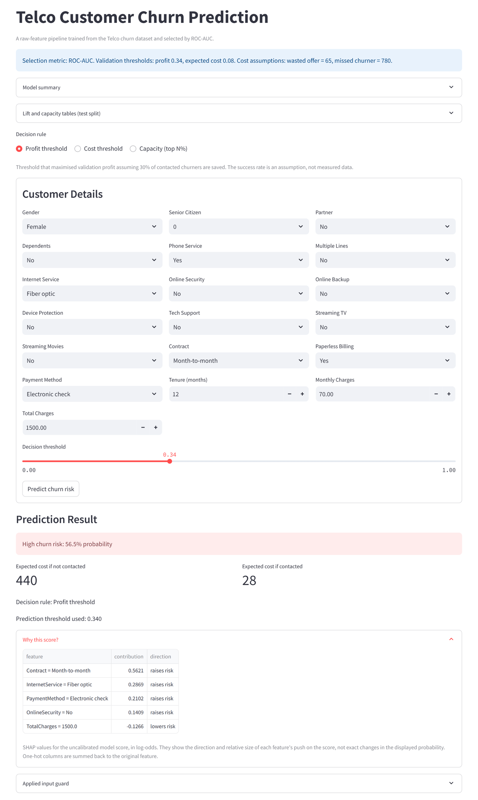
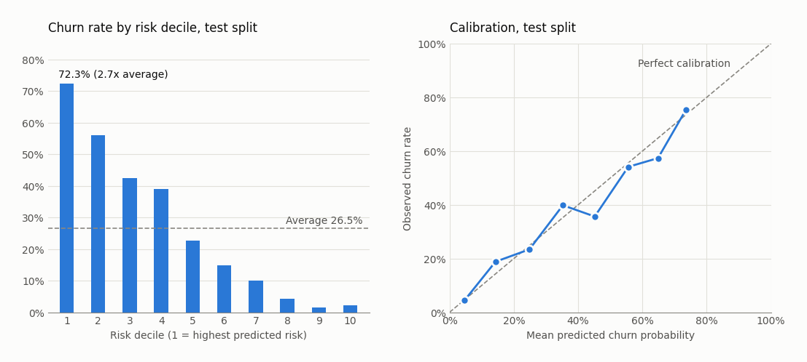

# Telco Customer Churn Prediction

[](https://customer-churn-risk-app.streamlit.app)
[](https://github.com/poojithareddy19/Customer-Churn-Prediction/actions/workflows/ci.yml)

[](LICENSE)

Predicts whether a telecom customer is likely to churn, using a calibrated gradient-boosting pipeline trained on the IBM Telco Customer Churn dataset and served through a Streamlit interface that returns a churn probability, a risk verdict, the expected cost of contacting or not contacting the customer, and the main reasons behind the score.

**Live demo:** [customer-churn-risk-app.streamlit.app](https://customer-churn-risk-app.streamlit.app)

Five candidate pipelines across three model families (logistic regression, Random Forest and XGBoost, each class-weighted or with SMOTE) were compared under 5-fold stratified cross-validation and tuned with randomised search. The winner, class-weighted XGBoost with no SMOTE, was calibrated and evaluated on a held-out test set.

**Headline result:** at the profit-maximising threshold of 0.34, the model contacts 37% of the 1,409 test customers and reaches 75.1% of churners (281 of 374) at 53.7% precision, for an expected profit of 42,870 under the stated assumptions. Test ROC-AUC is 0.836 (95% CI 0.815 to 0.859), against a majority-class baseline that catches zero churners.

<p align="center">
  
</p>

**Contents:** [Findings](#findings-and-recommendations) · [Problem](#problem) · [Dataset](#dataset) · [Pipeline](#pipeline) · [First version](#what-was-wrong-with-the-first-version) · [Results](#results) · [Feature importance](#feature-importance) · [Segment analysis](#segment-analysis) · [Monitoring](#monitoring) · [Project structure](#project-structure) · [Installation](#installation) · [Usage](#usage) · [Design decisions](#design-decisions) · [Limitations](#limitations) · [Roadmap](#roadmap)

---

## Findings and Recommendations

A two-minute summary for decision makers. Sources are listed with each point; test-split numbers cover 1,409 held-out customers. Money values throughout are in the units of the dataset's `MonthlyCharges` column, usually read as US dollars.

**Who churns most** (`reports/segment_analysis.md`, all 7,043 customers)

- New customers: 52.9% of customers in their first 6 months churn, against 9.5% of customers past 4 years.
- Month-to-month customers paying by electronic check are 26.3% of the base but 53.2% of all churners (churn rate 53.7%).
- Fiber optic customers without online security or tech support churn at 55.0%.
- Month-to-month contracts hold 86.9% of the monthly revenue lost to churn.

These are correlations in a single snapshot. They show where churn is concentrated, not what would stop it.

**What the model achieves** (`artifacts/training_report.json`, bootstrap 95% intervals over 1,000 resamples of the test split)

| Measure | Value | 95% CI |
| --- | --- | --- |
| ROC-AUC (ranking quality) | 0.836 | 0.815 to 0.859 |
| Top-decile lift (churn rate in the riskiest 10% vs average) | 2.73x | 2.45x to 3.04x |

Across five different random splits the test ROC-AUC averages 0.848 (standard deviation 0.009, `reports/seed_stability.csv`), so the headline 0.836 is at the low end, not a lucky split.

**Recommended contact strategy** (capacity and lift tables in the report)

| Rule | Customers contacted | Churners reached | Precision |
| --- | --- | --- | --- |
| Top 10% by risk | 10% | 27.3% | 72.3% |
| Top 20% by risk | 20% | 48.4% | 64.2% |
| Top 40% by risk | 40% | 79.1% | 52.5% |
| **Profit threshold 0.34, app default (30% offer success assumed)** | **37.1%** | **75.1%** | **53.7%** |
| Cost-only rule, threshold 0.08 | 63.0% | 94.4% | 39.8% |

- If the retention team has a fixed capacity, contact the top N% by score. The top 20% reaches almost half of all churners at 2.4 times the average churn rate.
- The cost-only rule (0.08) catches more churners, but only by contacting 63% of all customers at 40% precision. Its threshold is so low because the costs fix it almost by themselves: with 65 for a wasted offer and 780 for a missed churner, the break-even probability is 65 / (65 + 780) = 0.077. Those assumptions also treat every contacted churner as saved. The profit model below assumes only 30% are saved and recommends contacting far fewer customers (threshold 0.34). Until the real offer success rate is known, the profit threshold is the more defensible starting point, so the app uses it by default. The cost and capacity rules are one click away.

**Expected profit under stated assumptions** (`profit_analysis` in the report)

Assumptions: an offer costs 65, a saved customer is worth 12 months of their own monthly charge, and the offer success rate is an **assumption, not data**. The threshold is chosen on the validation split and the profit is measured on the 1,409 test customers.

| Assumed success rate | Threshold | Customers contacted | Test profit |
| --- | --- | --- | --- |
| 10% | 0.67 | 139 | 508.84 |
| 20% | 0.46 | 379 | 17,064.64 |
| 30% (default) | 0.34 | 523 | 42,869.50 |
| 50% | 0.18 | 674 | 102,068.30 |

At the cost threshold the 30% scenario earns 38,107.70 on the test split, less than the 42,869.50 from the profit threshold. At a 10% offer success rate the campaign barely breaks even (profit 509), so the success rate should be measured in a pilot before scaling.

**Proposed experiment** ([docs/experiment_plan.md](docs/experiment_plan.md))

A 50/50 randomised test of the offer on model-flagged customers, measuring 90-day retention. Detecting a 5 percentage point lift over the 60.2% baseline retention of flagged customers needs 1,467 customers per arm (`reports/experiment_sizing.md`).

**Main caveat:** the data is a correlational snapshot, and the offer costs and success rate are assumptions, so nothing here shows that an offer would reduce churn. Full list under [Limitations](#limitations).

---

## Problem

Acquiring a telecom subscriber costs substantially more than retaining one. A retention team can only act on customers it can identify in advance, so the useful output is not a churn label but a calibrated probability that lets limited retention budget go to the highest-risk accounts first, together with a decision threshold that reflects the relative cost of a missed churner versus an unnecessary retention offer.

## Dataset

- Source: IBM Telco Customer Churn, as published on [Kaggle](https://www.kaggle.com/datasets/blastchar/telco-customer-churn) (`WA_Fn-UseC_-Telco-Customer-Churn.csv`, included in this repo)
- 7,043 customers, 19 features covering demographics, subscribed services, and account information
- Target: `Churn` (Yes/No), imbalanced at roughly 73/27 (1,869 churners)

## Pipeline

All training and inference code lives in `src/`. The notebook is kept as the original exploratory analysis but is no longer the source of the deployed model.

1. **Loading and cleaning** (`src/features.py`)
   `customerID` is dropped, `Churn` is mapped to 0/1, and `TotalCharges` is converted to numeric. The 11 rows with a blank `TotalCharges` all have zero tenure, meaning the customer had not yet been billed, so they are filled with 0.0. A median imputer inside the pipeline remains as a safety net for unseen data.

2. **Preprocessing** (`src/features.py`)
   A `ColumnTransformer` scales the four numeric columns and one-hot encodes the fifteen categorical columns with `handle_unknown="ignore"`. Everything is fitted inside the model pipeline, so there are no separate encoder files and no leakage from the test set.

3. **Splitting** (`src/train.py`)
   Stratified 60/20/20 train, validation, test split with `random_state=42`. The validation split is used only to choose the decision threshold. The test split is touched once, at the end.

4. **Candidate comparison**
   Five pipelines across three model families are scored by ROC-AUC under 5-fold stratified cross-validation on the training split: balanced logistic regression, Random Forest (class-weighted and SMOTE), and XGBoost (class-weighted and SMOTE). SMOTE is applied through an `imblearn` pipeline, so resampling happens inside each fold on training data only. Per-fold scores are stored, not only the mean.

5. **Tuning**
   The Random Forest and XGBoost variants and a class-weighted logistic regression (`C` on a log scale from 0.001 to 100, `l1` or `l2` penalty, `liblinear` solver) are tuned with `RandomizedSearchCV` (10 iterations, ROC-AUC scoring). The tuned pipeline with the highest mean CV ROC-AUC is selected, with no preference for any model family.

6. **Calibration and threshold**
   The winner is wrapped in `CalibratedClassifierCV` (sigmoid). Calibration is fitted on the training split, the resulting probabilities are scored on the validation split, and the decision threshold that minimises expected cost is recorded. The final model is then recalibrated on train plus validation.

7. **Evaluation** (`src/evaluate.py`)
   ROC-AUC, Brier score, confusion matrix at the chosen threshold, a calibration table, permutation importance, lift and capacity tables, bootstrap confidence intervals, logistic regression odds ratios and a profit analysis.

8. **Serialisation**
   The calibrated pipeline, the threshold, the feature column order, and the full report are saved together to `artifacts/churn_model.joblib`. A human-readable copy of the report is written to `artifacts/training_report.json`, with the run timestamp and git commit. If MLflow is installed (`requirements-dev.txt`), the run is also logged there.

9. **Deployment** (`app.py`)
   Streamlit app that loads the artifact, exposes all 19 inputs, applies consistency guards (no internet service implies no add-ons, no phone service implies no multiple lines), and shows the probability, verdict, and expected cost of each decision. Three decision rules are offered: the profit threshold (the default, 0.34) and the cost threshold (0.08), both adjustable with a slider, and a capacity rule (top N% by score). A "Why this score?" panel shows the top five SHAP contributions, and every prediction is appended to `logs/predictions.jsonl`.

## What was wrong with the first version

The first model lives in `Customer_Churn_Prediction_Using_ML.ipynb` (commits from 31 Jan to 3 Feb 2026). Its numbers were optimistic for four reasons. Cell numbers below are the execution counts shown in the notebook.

1. **Cross-validation on oversampled data.** The data was split at `In [45]`, then SMOTE was applied to the whole training set at `In [49]`, growing it from 5,634 to 8,276 rows. `In [53]` then ran `cross_val_score(model, x_train_smote, y_train_smote, cv=5, scoring="accuracy")` on the already-oversampled rows. Synthetic churners are interpolated between real churners, so near-copies of the validation points sat in the training folds.
2. **The CV score did not hold up.** Random Forest scored 0.84 CV accuracy but 0.78 on the held-out test set (`In [58]`).
3. **The fold scores show the problem.** The Random Forest folds were 0.73, 0.78, 0.91, 0.89 and 0.90 (`In [54]`). SMOTE appends its synthetic rows to the end of the data and `cross_val_score` does not shuffle, so the churners in the last three folds are almost all synthetic, and those folds are much easier to predict.
4. **Smaller issues.** `LabelEncoder` was fitted on the full dataset before the split (`In [39]`), and models were compared by accuracy on a 73/27 target, where predicting "nobody churns" already scores 73.5%.

**The fix** came in commit `0605f9a` ("Refactor training pipeline into src package", 26 Sep 2026). SMOTE now sits inside an `imblearn` pipeline, so it only ever runs on the training part of each fold, and models are selected by ROC-AUC instead of accuracy. The notebook is kept unchanged as a record of the original work.

---

## Results

All numbers come from `artifacts/training_report.json` and the files in `reports/`, and are reproducible with the commands under Usage. Threshold-dependent metrics below (recall, precision, confusion matrix, bootstrap intervals) are reported at the 0.08 cost-only threshold that is saved with the model. The profit threshold of 0.34, which the app uses by default, is summarised under Findings and Recommendations.

<picture>
  <source media="(prefers-color-scheme: dark)" srcset="docs/images/model_charts_dark.png">
  
</picture>

### Candidate comparison, 5-fold cross-validated ROC-AUC on the training split

Mean and standard deviation across the five folds.

| Pipeline                        | Defaults        | Tuned               |
| ------------------------------- | --------------- | ------------------- |
| Logistic regression (balanced)  | 0.8443 ± 0.0214 | 0.8444 ± 0.0212     |
| Random Forest (class-weighted)  | 0.8227 ± 0.0132 | 0.8453 ± 0.0141     |
| Random Forest + SMOTE           | 0.8216 ± 0.0090 | 0.8437 ± 0.0139     |
| XGBoost + SMOTE                 | 0.8157 ± 0.0132 | 0.8453 ± 0.0143     |
| XGBoost (class-weighted)        | 0.8132 ± 0.0102 | **0.8481 ± 0.0159** |

Class-weighted XGBoost was selected after tuning, so the deployed model does not use SMOTE (the SMOTE variants were only candidates) (350 shallow trees, depth 4, learning rate 0.01, subsample 0.85, column subsample 0.7, L2 regularisation 5). Tuning barely moves logistic regression (best: `l2`, `C` = 2.64), and it stays within 0.004 ROC-AUC of the tuned tree models, which is typical for this dataset. Its fold-to-fold standard deviation (0.021) is larger than that gap, so the ranking among the top candidates is not decisive.

### Held-out splits

| Metric                    | Validation (1,409) | Test (1,409) |
| ------------------------- | ------------------ | ------------ |
| ROC-AUC                   | 0.8596             | 0.8361       |
| Brier score               | 0.1302             | 0.1402       |
| Cost-optimal threshold    | 0.08               | 0.05         |
| Recall (churn) at 0.08    | 0.968              | 0.944        |
| Precision (churn) at 0.08 | 0.39               | 0.40         |
| Accuracy at 0.08          | 0.594              | 0.606        |

Test confusion matrix at the cost threshold of 0.08:

```
              predicted
              no    yes
actual  no   501    534
       yes    21    353
```

**Why not accuracy.** The majority class is 73.5% of the data, so a model that predicts "nobody churns" scores 73.5% accuracy while identifying zero churners. ROC-AUC measures ranking quality independent of the threshold, and the Brier score measures whether the probabilities themselves are trustworthy, which matters because the app shows them to a human.

### Uncertainty and stability

Bootstrap 95% percentile intervals on the test split (1,000 resamples, seed 42, no resample skipped), at the cost threshold of 0.08:

| Metric          | Estimate | 95% CI             |
| --------------- | -------- | ------------------ |
| ROC-AUC         | 0.8361   | 0.8146 to 0.8590   |
| Brier score     | 0.1402   | 0.1295 to 0.1512   |
| Recall          | 0.9439   | 0.9208 to 0.9648   |
| Precision       | 0.3980   | 0.3641 to 0.4304   |
| Expected cost   | 51,090   | 44,525 to 57,658   |
| Top-decile lift | 2.73     | 2.45 to 3.04       |

`scripts/seed_stability.py` repeats the split, calibration and evaluation of the selected configuration with five seeds (`reports/seed_stability.csv`). Seed 42 reproduces the deployed test metrics exactly.

| Seed | Test ROC-AUC | Test Brier | Test recall |
| ---- | ------------ | ---------- | ----------- |
| 0    | 0.8515       | 0.1329     | 0.9706      |
| 1    | 0.8610       | 0.1289     | 0.9786      |
| 2    | 0.8482       | 0.1349     | 0.8984      |
| 3    | 0.8434       | 0.1362     | 0.9866      |
| 42   | 0.8361       | 0.1402     | 0.9439      |
| Mean ± std | 0.8480 ± 0.0093 | 0.1346 ± 0.0042 | 0.9556 ± 0.0358 |

Recall varies more than ROC-AUC because the cost threshold chosen on each validation split varies (0.04 to 0.12).

### Lift and capacity

Test split, ranked by predicted probability:

| Decile | Churn rate | Lift | Cumulative share of churners |
| ------ | ---------- | ---- | ---------------------------- |
| 1      | 72.3%      | 2.73 | 27.3%                        |
| 2      | 56.0%      | 2.11 | 48.4%                        |
| 3      | 42.6%      | 1.60 | 64.4%                        |
| 4      | 39.0%      | 1.47 | 79.1%                        |
| 5      | 22.7%      | 0.85 | 87.7%                        |
| 6 to 10 | 1.4% to 14.9% | 0.05 to 0.56 | 93.3% to 100% |

| Capacity | Contacted | Probability cutoff | Recall | Precision | Expected cost |
| -------- | --------- | ------------------ | ------ | --------- | ------------- |
| 5%       | 71        | 0.720              | 0.155  | 0.817     | 247,325       |
| 10%      | 141       | 0.669              | 0.273  | 0.723     | 214,695       |
| 20%      | 282       | 0.561              | 0.484  | 0.642     | 157,105       |
| 30%      | 423       | 0.413              | 0.644  | 0.570     | 115,570       |
| 40%      | 564       | 0.294              | 0.791  | 0.525     | 78,260        |
| 50%      | 705       | 0.160              | 0.877  | 0.465     | 60,385        |

Expected cost uses the default costs (65 per offer, 780 per missed churner). Of the capacities listed, 50% has the lowest expected cost; the cost threshold of 0.08 (63% contacted, expected cost 51,090) is lower still. The app's capacity mode uses the probability cutoffs in this table.

### About the threshold

The threshold is chosen to minimise expected cost under the defaults in `src/features.py`, which are derived from the dataset's mean monthly charge of about 65: a wasted retention offer is assumed to cost one month of revenue (65) and a missed churner twelve months of revenue (780). With a 12:1 cost ratio the break-even probability is about 7.7%, and the validation split picks 0.08. On the test split that flags 63% of customers and catches 94% of churners. The test split's own cost curve prefers 0.05, so the optimum is flat in that region and the exact value should not be over-interpreted.

This cost model implicitly assumes that contacting a churner always prevents the loss. The profit analysis relaxes that with an explicit success rate (see Findings and Recommendations); with a 30% success rate its validation-chosen threshold is 0.34. Because the cost rule's assumption is unrealistic, the app defaults to the profit threshold. The 0.08 cost threshold is still the one saved in the artifact and used for the evaluation metrics in this section, and it remains selectable in the app.

---

## Feature importance

Permutation importance (drop in test ROC-AUC when the column is shuffled, mean of 10 repeats):

| Feature         | Importance |
| --------------- | ---------- |
| Contract        | 0.087      |
| tenure          | 0.030      |
| InternetService | 0.016      |
| MonthlyCharges  | 0.010      |
| TotalCharges    | 0.007      |
| OnlineSecurity  | 0.005      |
| TechSupport     | 0.002      |
| StreamingMovies | 0.002      |

Permutation importance is preferred over Gini importance because it is measured on held-out data and is not biased toward high-cardinality or continuous columns. Under this measure contract type is by far the strongest signal.

**Logistic regression odds ratios.** The tuned logistic regression, fitted on the training split, gives an interpretable cross-check (`logistic_odds_ratios` in the report, top 15 stored). Numeric features are standardised, so their odds ratio is per one standard deviation.

| Feature                       | Odds ratio |
| ----------------------------- | ---------- |
| tenure (per SD)               | 0.29       |
| Contract = Two year           | 0.45       |
| MonthlyCharges (per SD)       | 0.46       |
| InternetService = Fiber optic | 2.02       |
| Contract = Month-to-month     | 1.93       |
| TotalCharges (per SD)         | 1.87       |
| InternetService = DSL         | 0.54       |

tenure, MonthlyCharges and TotalCharges are strongly correlated (TotalCharges is roughly tenure times MonthlyCharges), so their individual coefficients should not be read in isolation. The seven "No internet service" columns encode the same customers and receive identical coefficients (odds ratio 0.74), which is why they fill several of the remaining top-15 rows.

**Per-customer explanations.** The app's "Why this score?" panel runs `shap.TreeExplainer` on the uncalibrated XGBoost model inside the first calibration fold and sums one-hot contributions back to each original feature. The values are in log-odds and show direction and relative size, not exact changes in the displayed probability.

## Segment analysis

`scripts/segment_analysis.py` runs the six DuckDB queries in `sql/` directly on the CSV, adds 95% Wilson intervals and writes `reports/segment_analysis.md` plus one CSV per query in `reports/segments/`. Churn by contract type:

| Contract       | Churn rate |
| -------------- | ---------- |
| Month-to-month | 42.7%      |
| One year       | 11.3%      |
| Two year       | 2.8%       |

Month-to-month customers churn at roughly **15x** the rate of two-year customers. Contract length is both the top predictor and a variable a retention team can act on, through migration offers and incentives, although only an experiment can show whether moving a customer to a longer contract changes their behaviour.

## Monitoring

`scripts/drift_check.py` computes the population stability index (PSI, `src/monitoring.py`) for `tenure`, `MonthlyCharges`, `TotalCharges` and the predicted probability. The dataset has no time dimension, so real drift over time cannot be measured; the report (`reports/drift_report.md`) demonstrates the method. Training vs test split is stable on every column (PSI 0.007 to 0.011). A SIMULATED shift made of month-to-month customers only gives PSI 0.58 on tenure and 3.69 on the predicted probability, which would trigger an alert.

---

## Project structure

```
├── app.py                                     # Streamlit interface
├── src/
│   ├── features.py                            # dataset loading, preprocessing, form schema, cost and profit assumptions
│   ├── train.py                               # candidate comparison, tuning, calibration, report and artifact export
│   ├── evaluate.py                            # metrics, cost curve, lift, capacity, bootstrap, odds ratios, profit curve
│   ├── app_helpers.py                         # SHAP explanation, prediction logging, report key fallback
│   ├── segments.py                            # DuckDB query runner and Wilson interval
│   ├── experiment.py                          # sample size, SRM check, A/B analysis
│   └── monitoring.py                          # population stability index
├── sql/                                       # 01 to 06 segment and cohort queries (DuckDB)
├── scripts/
│   ├── seed_stability.py                      # reports/seed_stability.csv
│   ├── segment_analysis.py                    # reports/segment_analysis.md and reports/segments/
│   ├── experiment_sizing.py                   # reports/experiment_sizing.md
│   ├── readme_charts.py                       # docs/images/model_charts_*.png
│   └── drift_check.py                         # reports/drift_report.md
├── reports/                                   # generated analysis outputs (committed)
├── docs/
│   ├── experiment_plan.md                     # retention offer experiment design
│   └── images/                                # README screenshot and charts
├── tests/                                     # pytest suite, 42 tests across 7 modules
├── artifacts/                                 # committed; regenerate with python -m src.train
│   ├── churn_model.joblib                     # {model, threshold, report, feature_columns}
│   └── training_report.json
├── .github/workflows/ci.yml                   # runs the tests on push and pull request
├── Customer_Churn_Prediction_Using_ML.ipynb   # original EDA and first model (superseded by src/)
├── WA_Fn-UseC_-Telco-Customer-Churn.csv       # dataset
├── requirements.txt                           # app, training and analysis dependencies
├── requirements-dev.txt                       # adds pytest and MLflow
└── README.md
```

## Installation

Python 3.11 is recommended; the pinned versions in `requirements.txt` were tested on it.

```bash
git clone https://github.com/poojithareddy19/Customer-Churn-Prediction.git
cd Customer-Churn-Prediction
python -m venv .venv
.venv\Scripts\activate        # Windows
# source .venv/bin/activate   # macOS / Linux
pip install -r requirements.txt
```

## Usage

The trained artifact is committed, so the app runs straight after installation. To retrain (a few minutes; prints the test metrics when done):

```bash
python -m src.train
```

Run the app:

```bash
python -m streamlit run app.py
```

If `artifacts/churn_model.joblib` is ever missing, the app trains on first load and shows a warning while it does so. Predictions are appended to `logs/predictions.jsonl` (ignored by git).

Regenerate the analysis reports (run after retraining so they use the current model):

```bash
python scripts/seed_stability.py
python scripts/segment_analysis.py
python scripts/experiment_sizing.py
python scripts/drift_check.py
python scripts/readme_charts.py
```

The decision costs can be overridden without editing code. Set the variables in the same terminal before training and the threshold is recomputed. The app reads the costs saved with the model, so restart it after retraining.

```powershell
# Windows PowerShell
$env:CHURN_FALSE_POSITIVE_COST = "100"
$env:CHURN_FALSE_NEGATIVE_COST = "1500"
python -m src.train
```

```bat
:: Windows Command Prompt (cmd.exe)
set CHURN_FALSE_POSITIVE_COST=100
set CHURN_FALSE_NEGATIVE_COST=1500
python -m src.train
```

```bash
# macOS / Linux
export CHURN_FALSE_POSITIVE_COST=100
export CHURN_FALSE_NEGATIVE_COST=1500
python -m src.train
```

The profit analysis in the report uses three more assumptions, also read at training time: `CHURN_OFFER_COST` (default 65), `CHURN_OFFER_SUCCESS_RATE` (default 0.30, the share of contacted churners who stay, which is an assumption and not measured in this data) and `CHURN_RETENTION_MONTHS` (default 12). They set the profit threshold the app uses by default, and do not change the cost threshold saved with the model.

Run the 42 tests (installs pytest and MLflow on top of the app dependencies). With MLflow installed, `python -m src.train` also logs each run to a local `mlflow.db` (ignored by git); view it with `mlflow ui --backend-store-uri sqlite:///mlflow.db`.

```bash
pip install -r requirements-dev.txt
python -m pytest -q
```

---

## Design decisions

| Decision                                  | Rationale                                                                                                          |
| ----------------------------------------- | ------------------------------------------------------------------------------------------------------------------ |
| One-hot encoding inside a pipeline        | No separate encoder files, no false ordinality, and the same preprocessing is reusable by linear and tree models    |
| SMOTE inside the CV pipeline              | Resampling happens per fold on training data only, so cross-validation scores are honest                            |
| ROC-AUC as the selection metric           | Threshold-independent, so model choice is not entangled with the business cost tradeoff                              |
| Separate validation split for the threshold | The threshold is a hyperparameter; choosing it on the test split would make the test metrics optimistic             |
| Calibrate before choosing the threshold   | The deployed model outputs calibrated probabilities, so the threshold must be picked on that same scale               |
| Cost-based threshold                      | Makes the FP/FN tradeoff explicit and tunable instead of hiding it behind the default 0.5                              |
| Capacity rule alongside the cost rule     | Retention teams usually have a fixed number of calls to make, which a top N% rule matches directly                    |
| Bootstrap intervals and seed stability    | A single test split of 1,409 customers gives a noisy estimate; intervals show how much the numbers could move         |
| Permutation importance                    | Measured on held-out data and not biased toward continuous columns, unlike Gini importance                           |
| `TotalCharges` blanks filled with 0.0     | All 11 rows have zero tenure, so the customer had not yet been billed                                                |
| Feature order persisted with the model    | The app builds its input frame from the saved column list, so form and model cannot drift apart                      |

## Limitations

- **Cost and profit assumptions are estimates.** The default costs are derived from the dataset's mean monthly charge, not from a real offer cost or customer lifetime value, and the offer success rate is a pure assumption. Replace them through the environment variables, and measure the success rate with the experiment in `docs/experiment_plan.md`, before using either threshold operationally.
- **Small randomised search.** 10 iterations per model family. A larger search might change the winner, since the tuned models are within 0.005 ROC-AUC of each other and the fold standard deviations are larger than that.
- **Static snapshot.** No time dimension, so the model cannot express when a customer is likely to churn, only whether, and drift can only be demonstrated with simulated shifts.
- **Correlation, not causation.** A customer flagged as high-risk on a month-to-month contract does not mean moving them to an annual contract will retain them. A high churn score also does not mean the customer will respond to an offer; the experiment plan describes uplift modelling for that.

## Roadmap

- [x] Wrap SMOTE in an `imblearn` pipeline inside cross-validation
- [x] Hyperparameter tuning for Random Forest, XGBoost and logistic regression
- [x] Cost-based threshold tuning on a separate validation split
- [x] Probability calibration and Brier score reporting
- [x] Make the cost assumptions configurable through environment variables
- [x] Capacity-based thresholding (top N% of customers by probability)
- [x] SHAP values for per-customer explanations in the app
- [x] Bootstrap confidence intervals, lift tables and seed stability
- [x] Retention experiment design with power analysis
- [ ] Run the retention experiment and fit an uplift model on its results
- [ ] SMOTENC in place of SMOTE for categorical-aware resampling
- [ ] Move the notebook EDA onto `src/` helpers so it runs locally without the Colab path

## License

Apache-2.0. See `LICENSE`.
